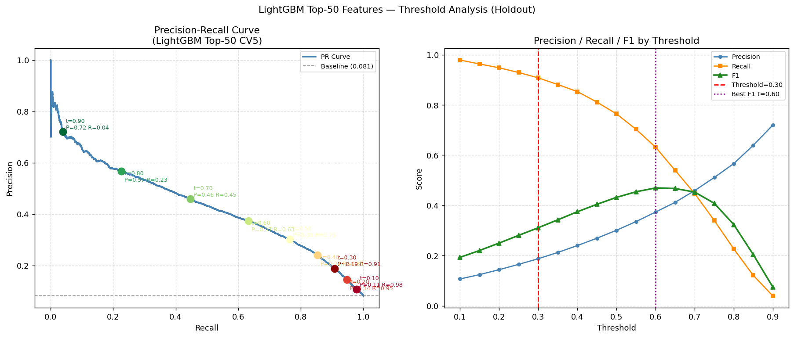

# LightGBM Top-50 Features CV5 — Metrics Report

**Trained at:** 20260421  
**Fixed threshold:** `0.30`  
**scale_pos_weight (final split):** `11.3871`  
**Features:** 50 (top-50 by gain from prior CV5 model)  

## Cross-Validation Summary (5-Fold)

| Metric | Mean | Std |
|---|---:|---:|
| AUC-ROC | 0.880048 | 0.001966 |
| Gini | 0.760096 | 0.003932 |
| KS | 0.622931 | 0.002910 |
| PR-AUC | 0.437395 | 0.002972 |
| Brier Score | 0.117121 | 0.000477 |
| Precision | 0.187068 | 0.000889 |
| Recall | 0.909189 | 0.004040 |
| F1-Score | 0.310292 | 0.001382 |

## Holdout Metrics (threshold=0.30)

| Metric | Value |
|---|---:|
| AUC-ROC | 0.878313 |
| Gini | 0.756627 |
| KS | 0.621884 |
| PR-AUC | 0.433122 |
| Precision | 0.187713 |
| Recall | 0.907754 |
| F1-Score | 0.311096 |
| Brier Score | 0.116939 |

**Confusion Matrix (holdout):** `[[74069, 39006], [916, 9014]]`

## Best F1 Threshold (Holdout)

| Threshold | Precision | Recall | F1 |
|---:|---:|---:|---:|
| **0.60** | 0.373556 | 0.631923 | **0.469545** |

## Precision-Recall Chart

Chart saved: `/Users/alikaanaka/Downloads/workintech-bitirme/reports/lgbm_top50_cv5_pr_threshold_chart_20260421.png`

## Precision / Recall / F1 by Threshold (Holdout)

| Threshold | Precision | Recall | F1 |
|---:|---:|---:|---:|
| 0.10 | 0.107173 | 0.978751 | 0.193192 |
| 0.15 | 0.124521 | 0.963041 | 0.220529 |
| 0.20 | 0.144082 | 0.947835 | 0.250140 |
| 0.25 | 0.165385 | 0.929104 | 0.280788 |
| 0.30 | 0.187713 | 0.907754 | 0.311096 ◀ |
| 0.35 | 0.212730 | 0.881168 | 0.342721 |
| 0.40 | 0.240061 | 0.853172 | 0.374693 |
| 0.45 | 0.269285 | 0.811380 | 0.404366 |
| 0.50 | 0.301023 | 0.764350 | 0.431937 |
| 0.55 | 0.335528 | 0.703122 | 0.454276 |
| 0.60 | 0.373556 | 0.631923 | 0.469545 |
| 0.65 | 0.412172 | 0.539476 | 0.467309 |
| 0.70 | 0.459027 | 0.447331 | 0.453103 |
| 0.75 | 0.510963 | 0.340282 | 0.408511 |
| 0.80 | 0.566465 | 0.226586 | 0.323694 |
| 0.85 | 0.639745 | 0.121249 | 0.203860 |
| 0.90 | 0.720074 | 0.039376 | 0.074668 |

## Fold Details

- **Fold 1**: AUC=0.879476, PR-AUC=0.439674, Precision=0.187003, Recall=0.905589, F1=0.309993, scale_pos_weight=11.39
- **Fold 2**: AUC=0.882635, PR-AUC=0.435543, Precision=0.187577, Recall=0.915408, F1=0.311355, scale_pos_weight=11.39
- **Fold 3**: AUC=0.876675, PR-AUC=0.434585, Precision=0.185367, Recall=0.905086, F1=0.307712, scale_pos_weight=11.39
- **Fold 4**: AUC=0.880718, PR-AUC=0.435063, Precision=0.187725, Recall=0.907477, F1=0.311095, scale_pos_weight=11.39
- **Fold 5**: AUC=0.880737, PR-AUC=0.442108, Precision=0.187670, Recall=0.912387, F1=0.311307, scale_pos_weight=11.39

## Top-50 Feature Names Used

`EXT_SOURCE_MEAN`, `CREDIT_TERM`, `EXT_SOURCE_PROD`, `EXT_SOURCE_3`, `b_avg_utilization`, `EXT_SOURCE_1`, `EXT_SOURCE_2`, `DAYS_EMPLOYED_PERCENT`, `int_max_ins_days_late_ever`, `DAYS_EMPLOYED`, `b_avg_loan_duration`, `int_avg_payment_performance`, `AMT_ANNUITY`, `DAYS_ID_PUBLISH`, `EXT_SOURCE_STD`, `int_total_remaining_installments`, `DAYS_LAST_PHONE_CHANGE`, `DAYS_REGISTRATION`, `b_total_current_debt`, `ANNUITY_INCOME_RATIO`, `AMT_CREDIT`, `AMT_GOODS_PRICE`, `CREDIT_INCOME_RATIO`, `AGE_YEARS`, `OWN_CAR_AGE`, `DAYS_BIRTH`, `int_total_remaining_debt`, `REGION_POPULATION_RELATIVE`, `int_total_prev_loans_count`, `cc_total_avg_utilization_ratio`, `INCOME_PER_PERSON`, `b_total_history_months`, `cc_total_credit_card_experience_months`, `AMT_INCOME_TOTAL`, `NAME_EDUCATION_TYPE_ENC`, `b_total_loan_count`, `ORGANIZATION_TYPE_ENC`, `CODE_GENDER_ENC`, `HOUR_APPR_PROCESS_START`, `OCCUPATION_TYPE_ENC`, `b_active_loan_count`, `cc_max_balance_ever`, `cc_avg_repayment_performance`, `TOTALAREA_MODE`, `cc_total_transaction_count`, `b_closed_loan_count`, `cc_total_current_debt`, `int_max_pos_dpd_ever`, `BASEMENTAREA_MODE`, `WEEKDAY_APPR_PROCESS_START_ENC`

## Saved Model

`/Users/alikaanaka/Downloads/workintech-bitirme/models_saved/lgbm_top50_cv5_threshold030_20260421.pkl`